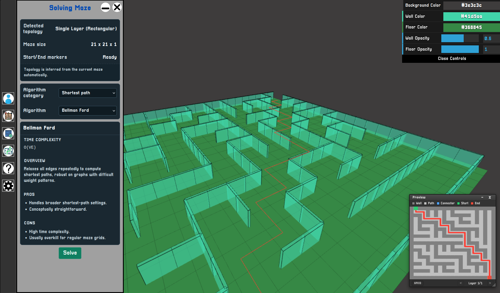

# MazeEngine


Practice 3D space calculations and algorithms for generating and solving mazes.

[](https://www.typescriptlang.org/) **&**
[](https://github.com/mrdoob/three.js) **&**
[](https://github.com/dataarts/dat.gui) [dat.GUI](https://github.com/dataarts/dat.gui)



## Repository Structure

- `frontend/`: Vite + TypeScript client app, toolbar/popup UI, 3D maze rendering, generation, solving.
- `backend/`: Supabase local backend setup, migrations, and backend-facing docs.
- `docs/`: onboarding, architecture, and contributor docs.
- `package.json` at repo root: workspace-style scripts that delegate to `frontend/` and `backend/`.

## Quick Start

```bash
npm --prefix frontend install
npm install
npm run dev
```

Open the Vite URL shown in the terminal.

`npm run dev` does two things:

1. starts Supabase locally from `backend/`
2. starts the frontend dev server from `frontend/`

## Prerequisites

- Node.js 20+
- Docker running locally
- Supabase CLI available on your machine or via local npm package

## First-Time Local Setup

```bash
npm --prefix frontend install
npm install
npm run supabase:init
npm run supabase:start
npm run supabase:reset
```

Create the frontend environment file:

```bash
cp frontend/.env.example frontend/.env
npm run supabase:status
```

Then copy the local Supabase URL and anon key into `frontend/.env`.

## Scripts

- `npm run dev`: start Supabase local and the frontend dev server
- `npm run dev:frontend`: start only the frontend dev server
- `npm run dev:docker`: start the frontend dev server through Docker Compose
- `npm run supabase:init`: initialize Supabase config in `backend/`
- `npm run supabase:start`: start the local Supabase stack
- `npm run supabase:stop`: stop the local Supabase stack
- `npm run supabase:status`: print local Supabase connection info
- `npm run supabase:reset`: rebuild the local database from migrations/seed
- `npm run build`: type-check and build the frontend
- `npm run preview`: preview the built frontend from `frontend/dist`
- `npm run lint`: run filename and ESLint checks
- `npm run test`: run lint and build
- `npm run format`: format the frontend project with Prettier

## Browser Compatibility Policy

MazeEngine targets modern browsers with native `PointerEvent` support.

- Supported baseline: current stable Chrome, Edge, Firefox, and Safari.
- Mobile baseline: Safari on iOS/iPadOS 13.4+ and Chrome on Android (current stable).
- Legacy browsers without `PointerEvent` are out of scope.
- Toolbar/popup interactions are implemented with pointer events only (no legacy `touchstart` + `mousedown` fallback).

## Documentation

- [Contributing Guide](./CONTRIBUTING.md)
- [Architecture Overview](./docs/architecture.md)
- [How to Add a Generator](./docs/how-to-add-generator.md)
- [Common Maze Rules](./docs/maze-rules.md)
- [Onboarding Guide](./docs/onboarding.md)
- [Backend Overview](./backend/README.md)
- [Supabase Backend Setup](./backend/supabase/README.md)

## Project Focus Areas

- Maze generation algorithms (`frontend/src/generator`)
- Maze solving algorithms (`frontend/src/solve`)
- Sidebar popup workflows (`frontend/src/sidebar/popup`)
- 3D rendering and app orchestration (`frontend/src/app`, `frontend/src/maze`)
- Account/auth and maze persistence (`frontend/src/sidebar/popup/account`, `frontend/src/lib`)
